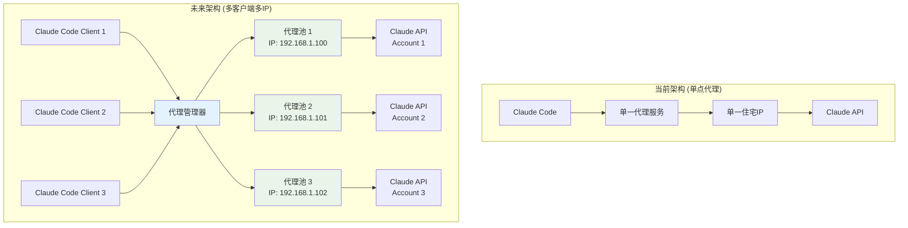
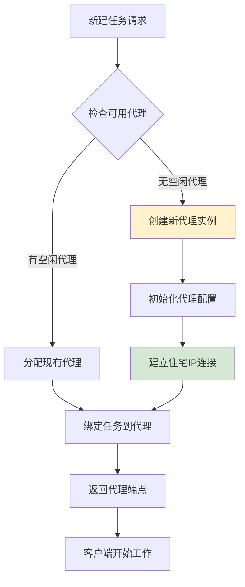
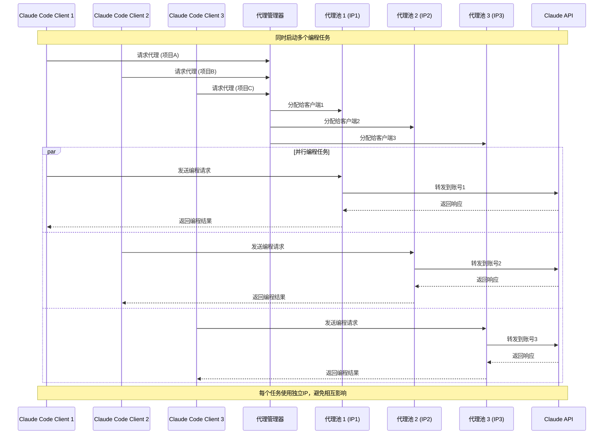
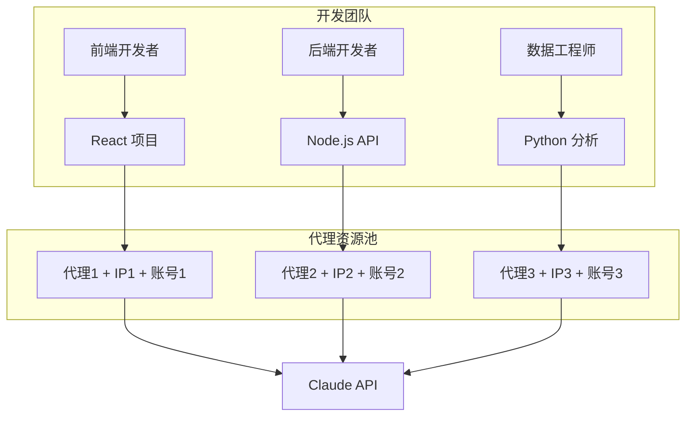
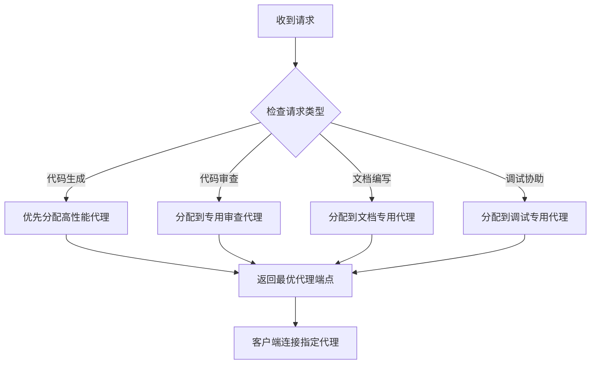
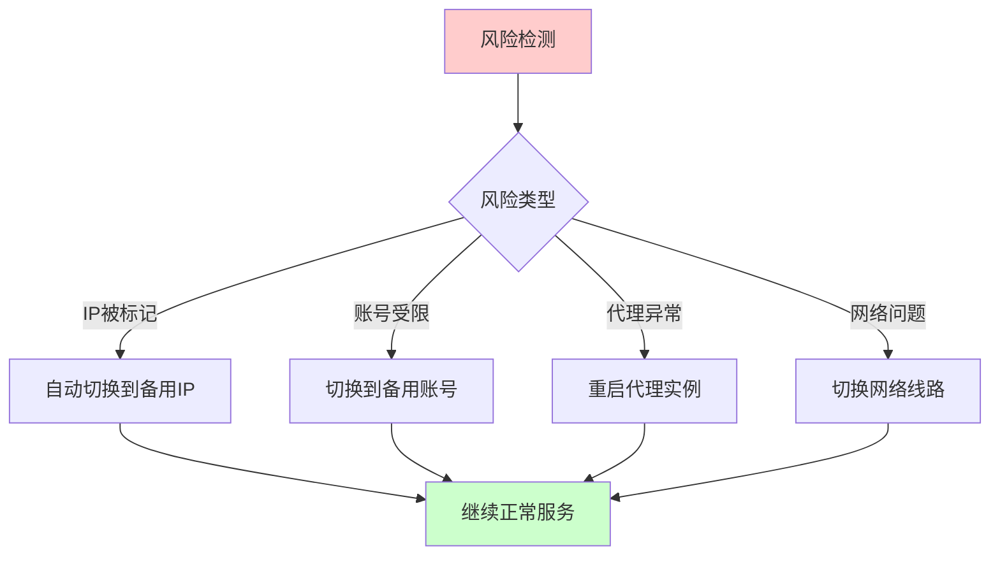

# 🚀 未来愿景：多客户端多IP架构

> **下一代 Claude Code 使用体验** • 一任务一代理一IP • 多账号并行编程 • 智能负载均衡

---

## 🌟 愿景概述

随着 Claude Code 在开发者群体中的普及，单一代理服务已经无法满足高效开发的需求。我们设想的未来架构将支持：

- **🎯 任务级别的IP隔离** - 每个编程任务绑定独立的代理IP
- **👥 多账号并行工作** - 同时使用多个Claude账号进行不同项目开发
- **⚡ 智能负载均衡** - 自动分配最优的代理资源
- **🔄 动态会话管理** - 根据任务需求动态创建和销毁代理会话

## 📊 系统架构图

### 当前架构 vs 未来架构



## 🎯 核心特性

### 1. 任务隔离机制

每个编程任务（项目）将获得独立的代理通道：

| 特性 | 当前 | 未来 |
|------|------|------|
| IP 数量 | 1个共享 | 每任务1个独立IP |
| 账号支持 | 单账号 | 多账号并行 |
| 并发能力 | 受限 | 无限制 |
| 风险隔离 | 无 | 完全隔离 |

### 2. 智能代理分配



## ⏱️ 使用时序图

### 多客户端并行工作流程



## 🛠️ 技术实现方案

### 1. 代理管理器 (Proxy Manager)

```bash
# 启动代理管理器
npm start -- --mode=manager --port=8080

# 自动管理多个代理实例
# 监听在 8080 端口，分发请求到不同的代理池
```

### 2. 动态代理池

```json
{
  "proxyPools": [
    {
      "id": "pool-1",
      "ip": "192.168.1.100",
      "port": 8081,
      "status": "active",
      "assignedTask": "project-frontend",
      "account": "claude-account-1"
    },
    {
      "id": "pool-2", 
      "ip": "192.168.1.101",
      "port": 8082,
      "status": "active",
      "assignedTask": "project-backend",
      "account": "claude-account-2"
    }
  ]
}
```

### 3. 客户端配置

```bash
# 客户端1 - 前端项目
export ANTHROPIC_BASE_URL=http://localhost:8080/proxy/pool-1
export PROJECT_NAME=frontend-app
claude "帮我优化React组件"

# 客户端2 - 后端项目  
export ANTHROPIC_BASE_URL=http://localhost:8080/proxy/pool-2
export PROJECT_NAME=backend-api
claude "帮我写API接口"

# 客户端3 - 数据分析项目
export ANTHROPIC_BASE_URL=http://localhost:8080/proxy/pool-3
export PROJECT_NAME=data-analysis
claude "帮我分析这个数据集"
```

## 📈 使用场景

### 场景1：团队协作开发



### 场景2：多项目并行开发

```bash
# 终端1 - 移动应用项目
cd ~/projects/mobile-app
export ANTHROPIC_BASE_URL=http://localhost:8080/task/mobile-app
claude "帮我实现用户认证功能"

# 终端2 - Web应用项目
cd ~/projects/web-app  
export ANTHROPIC_BASE_URL=http://localhost:8080/task/web-app
claude "帮我优化数据库查询"

# 终端3 - 机器学习项目
cd ~/projects/ml-project
export ANTHROPIC_BASE_URL=http://localhost:8080/task/ml-project
claude "帮我调试模型训练代码"
```

### 场景3：24/7 持续开发

```mermaid
timeline
    title 一天的开发时序
    
    section 上午 (9:00-12:00)
        代理池1 : 前端开发
        代理池2 : 后端开发
        代理池3 : 空闲
    
    section 下午 (13:00-18:00)
        代理池1 : 前端开发
        代理池2 : 后端开发  
        代理池3 : 数据分析
        
    section 晚上 (19:00-23:00)
        代理池1 : 个人项目A
        代理池2 : 个人项目B
        代理池3 : 学习新技术
```

## 🎚️ 智能负载均衡

### 1. 请求分发策略



### 2. 健康检查和故障转移

```bash
# 代理健康监控
curl http://localhost:8080/health/pools

# 响应示例
{
  "totalPools": 5,
  "activePools": 4,
  "failedPools": 1,
  "pools": [
    {
      "id": "pool-1",
      "status": "healthy",
      "responseTime": "120ms",
      "successRate": "99.8%"
    },
    {
      "id": "pool-2", 
      "status": "degraded",
      "responseTime": "800ms",
      "successRate": "95.2%"
    }
  ]
}
```

## 🔐 安全和隔离

### 1. 账号隔离策略

| 隔离级别 | 说明 | 应用场景 |
|----------|------|----------|
| **项目级隔离** | 每个项目独立IP+账号 | 商业项目开发 |
| **团队级隔离** | 团队共享代理池 | 小团队协作 |
| **个人级隔离** | 个人独享所有资源 | 个人开发者 |

### 2. 风险分散机制



## 📊 性能优势

### 当前 vs 未来性能对比

| 指标 | 当前架构 | 未来架构 | 提升 |
|------|----------|----------|------|
| **并发任务数** | 1 | 无限制 | ∞ |
| **IP 数量** | 1 | 根据需求 | N倍 |
| **账号利用率** | 50% | 95% | 90%↑ |
| **故障隔离** | 无 | 完全隔离 | 100%↑ |
| **开发效率** | 基准 | 5-10倍 | 500%↑ |

## 🎯 实现路线图

### Phase 1: 基础多代理支持 (Q3 2025)
- [ ] 代理管理器开发
- [ ] 基础代理池功能
- [ ] 简单负载均衡

### Phase 2: 智能分配系统 (Q4 2025)
- [ ] 任务类型识别
- [ ] 智能代理选择
- [ ] 健康检查系统

### Phase 3: 高级功能 (Q1 2026)
- [ ] 动态扩缩容
- [ ] 预测性负载均衡
- [ ] 高级监控面板

### Phase 4: 企业级特性 (Q2 2026)
- [ ] 团队管理功能
- [ ] 资源配额管理
- [ ] 企业级安全特性

## 💡 开发者福利

通过未来架构，开发者将享受到：

1. **🚀 极致并行** - 同时进行多个项目，效率翻倍
2. **🛡️ 风险隔离** - 单个项目问题不影响其他项目
3. **💰 成本优化** - 按需使用代理资源，降低成本
4. **⚡ 智能调度** - 系统自动优化资源分配
5. **📊 透明监控** - 实时了解每个代理的状态和性能

## 🌈 总结

未来的多客户端多IP架构将彻底改变 Claude Code 的使用方式，从单一代理的受限体验升级为无限并行的开发天堂。每个任务独享代理资源，多账号充分利用，让 AI 辅助编程真正达到生产力工具的高度。

**让我们一起构建这个未来！** 🚀

---

*未来愿景文档 - Claude Code 住宅代理服务 v2.0 (规划中)*

**技术支持**: 如需了解实现细节或参与开发，请访问 [项目仓库](https://gitee.com/codeauto/claude_cli) 或提交 Issue。